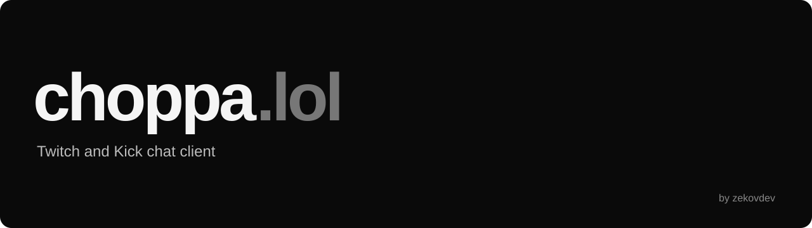
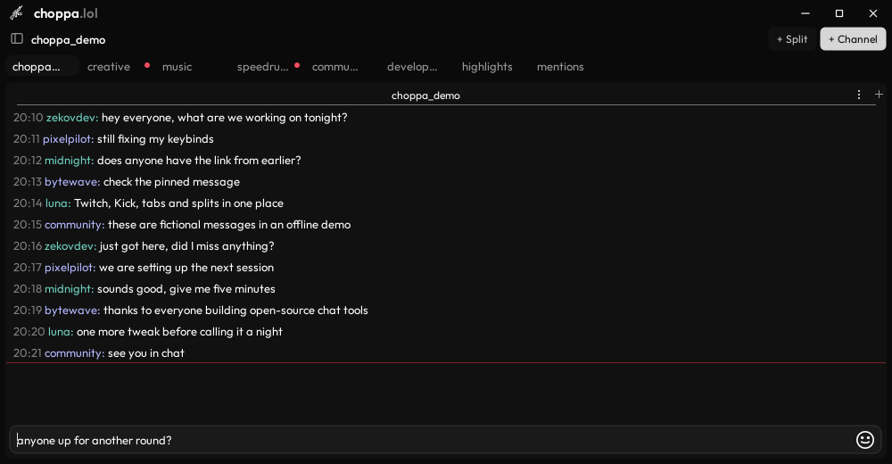
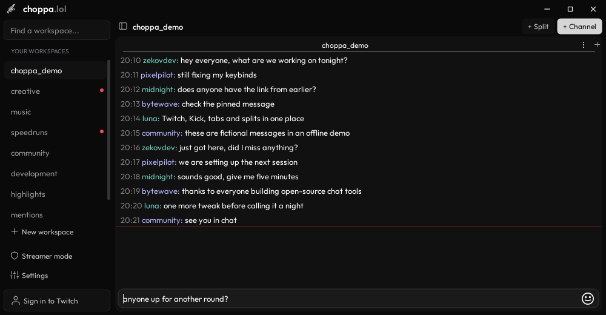
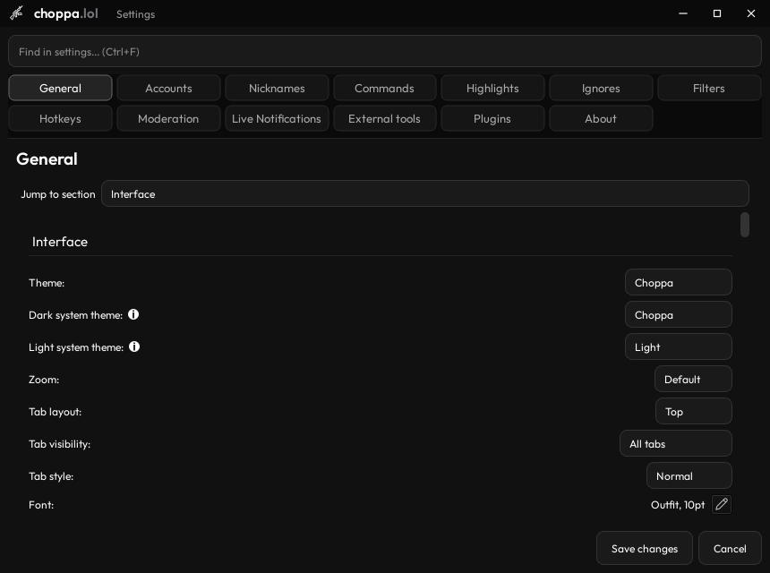
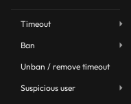
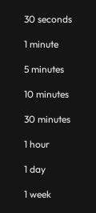
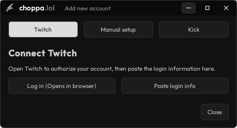
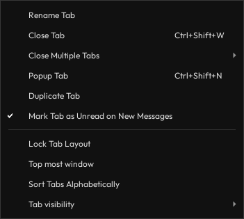

**Twitch and Kick desktop chat built with C++ and Qt.**

[Preview](#a-look-inside) | [Features](#features) | [Build](#build-it) | [Developer](#behind-the-project)

## About choppa.lol

**Zekerino is now choppa.lol.** The project has a new name and a redesigned interface. This repository contains the consolidated choppa.lol release.

choppa.lol is a Twitch and Kick chat client built on the Chatterino / Chatterino7 foundation. It keeps the chat engine, emote ecosystem and familiar power tools, then brings its own visual language and workflow to the desktop: restrained surfaces, compact navigation and more room for the conversation.

This is an independent hobby project, not an official Twitch, Kick or 7TV product. There is no commercial support promise.

## A look inside

**[Watch the short feature preview →](docs/media/choppa-preview.mp4)**

Screenshots are rendered from the actual Qt interface using an offline demo. Names, messages and live indicators are fictional. The video is an edited interface preview, not a latency benchmark or a live stream recording.

<strong>Full-size screenshots, settings, account setup and workspace actions</strong>

| Name menu moderation | Twitch timeout presets |
| --- | --- |
|  |  |

These captures use the same moderation action builder as the chat name menu. No moderation commands are sent during capture. Actions in the app require channel permissions.

| Connect an account | Organize your chat |
| --- | --- |
|  |  |

## What changes in this fork

The main differences are the Choppa interface, compact channel navigation, separate live and unread indicators, layout import and the reworked user-name moderation menu. The menu groups timeout presets, ban reasons, unban and Twitch suspicious-user actions in one place. Moderation itself also exists in other chat clients.

The preview shows chat tabs, the searchable sidebar, moderation actions, timeout choices, account setup, settings and tab actions. The table below also covers features that need live account data and are not demonstrated by the offline recording.

## Features

These are the areas this project changes or extends beyond its upstream base. They are practical differences, not a claim to outperform every other client.

| Area | What you get |
| --- | --- |
| **A different desktop feel** | Choppa branding, compact navigation, shared window controls and reworked account, settings, emote and user-card surfaces. |
| **7TV personality** | Name paints, badges and styled highlights, including paint loading for messages already in the chat history. |
| **Emotes where you type** | 7TV, BTTV and FFZ emote previews in the input, with an emote completion wheel. |
| **Moderation within reach** | Name-menu shortcuts for bans, timeouts and reversals; Twitch monitoring/restriction actions; a per-message moderation slider. Channel permissions still apply. |
| **Clearer navigation** | Red live indicators, separate unread/mention states, a searchable sidebar and full tab actions from either layout. |
| **Bring your channels** | Import of supported Zekerino/Chatterino channel layouts. Account credentials are not imported. |
| **Ready-to-select dictionaries** | Hunspell enabled in the Windows package with German and US-English dictionaries, including umlaut support. Spell checking is opt-in. |

Upstream tools remain part of the experience: tabs and splits, highlights, filters, hotkeys, logging and plugin APIs. Chatterino 2.5.5 also supplies lead-moderator support, Unicode 17 emoji data, the slowmode/timeout countdown, poll and prediction commands, Markdown notes, and more. Those features deserve their upstream credit.

See the [2.5.5 comparison](docs/CHOPPA-255-PARITY.md) and [implementation notes](docs/CHOPPA-DESKTOP.md) for specifics.

## Getting started

Check [Releases](https://github.com/zekovdev/choppa.lol/releases) for a current choppa.lol Windows package. If no current release is listed, build from source below. An old Zekerino archive is not necessarily the current Choppa version.

1. Extract the **entire** portable archive into a writable folder.
2. Run `ChoppaChat.exe`; keep its DLLs and subfolders beside it.
3. Connect your account in Settings → Accounts.
4. Add a channel, or let supported existing channel layouts be imported.

Enable the send-wait countdown in Settings → General if you want it. For spelling, open Settings → External tools, enable spell checking and select `de_DE` or `en_US` in the packaged Windows build.

Twitch controls what third-party clients may do. Polls and predictions need broadcaster permissions; some lead-moderator capabilities remain website-only. There is no channel-points farming feature.

## Build it

**C++23, CMake and Qt 6.** The current package is built and tested on Windows x64 with Qt 6.8.3. Hunspell is enabled by default on Windows; an existing CMake cache may need `-DCHATTERINO_SPELLCHECK=ON`.

- [Windows](BUILDING_ON_WINDOWS.md) | [Windows with vcpkg](BUILDING_ON_WINDOWS_WITH_VCPKG.md)
- [Linux](BUILDING_ON_LINUX.md) | [macOS](BUILDING_ON_MAC.md) | [FreeBSD](BUILDING_ON_FREEBSD.md)

The non-Windows guides are inherited from upstream. The Choppa interface has not been fully validated on every platform. Preserve your settings before trying development builds. Upstream automatic updating is disabled in the custom portable package so it cannot replace this build with another client.

## Behind the project

I'm **[zekovdev](https://github.com/zekovdev)**, a reverse engineer and C++ developer who likes taking software apart, understanding how it works and putting it back together differently.

I build choppa.lol in my spare time to try ideas, learn and make a chat client I enjoy using. My work here focuses on the interface, navigation and moderation tools. It is a personal hobby project.

If something feels off, a clear bug report helps more than a vague promise that everything is perfect. [Open an issue](https://github.com/zekovdev/choppa.lol/issues) with the build, steps to reproduce and a screenshot without tokens or private account information.

## Credit where it belongs

choppa.lol continues Zekerino and builds on **Chatterino, Chatterino7 and their contributors**. It would not exist without that work. Thanks also to the 7TV, BetterTTV, FrankerFaceZ, Qt, Hunspell and dictionary communities.

Project code is MIT-licensed; see [LICENSE](LICENSE). Third-party components, fonts and dictionaries retain their own licenses and attribution, included with the relevant source or packaged files.
