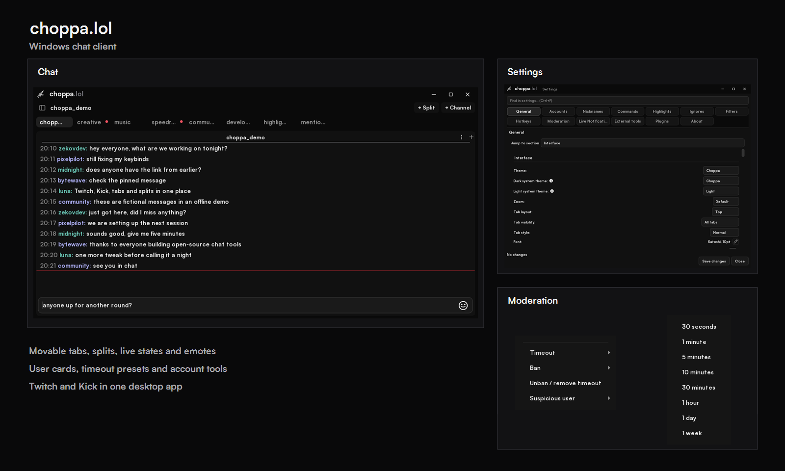

# choppa.lol

Twitch and Kick chat for Windows, built with C++ and Qt.

## Download

Download **choppa.lol.exe** from [Releases](https://github.com/zekovdev/choppa.lol/releases), open it and finish the setup.

## Features

- Twitch and Kick chat
- 7TV, BetterTTV, FrankerFaceZ and Twitch emotes
- movable chat tabs and splits
- separate live, unread and mention states
- emote menu and message completion
- user cards with ban, timeout and unban actions
- account switching, filters, highlights, hotkeys and notifications
- compact top tabs or a searchable chat list

## Build

The Windows build uses C++23, CMake and Qt 6. See [BUILDING_ON_WINDOWS.md](BUILDING_ON_WINDOWS.md).

## About

I am [zekovdev](https://github.com/zekovdev), a reverse engineer and C++ developer. choppa.lol is a hobby project I work on for fun.

The project is based on [Chatterino](https://github.com/Chatterino/chatterino2) and [chatterino7](https://github.com/SevenTV/chatterino7). Their licenses and credits are kept in this repository.

choppa.lol is not an official Twitch, Kick or 7TV product.
